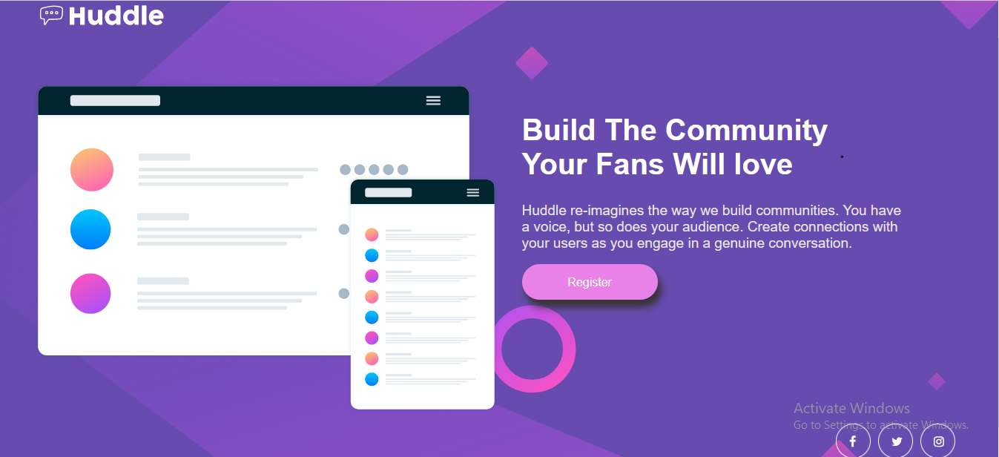

## Table of contents

- [Overview](#overview)
  - [The challenge](#the-challenge)
  - [Screenshot](#screenshot)
  - [Links](#links)
- [My process](#my-process)
  - [Built with](#built-with)
  - [What I learned](#what-i-learned)
- [Author](#author)

## Overview

### The challenge

Users should be able to:

- View the optimal layout for the page depending on their device's screen size
- See hover states for all interactive elements on the page

### Screenshot



### Links

- Solution URL: [Add solution URL here](https://your-solution-url.com)
- Live Site URL: https://mosestule2003.github.io/Responsive-Website/

## My process

### Built with

- Semantic HTML5 markup
- CSS custom properties
- Flexbox
- CSS Grid
- Mobile-first workflow

### What I learned

I was able to learn how to use css grid. I was able to fully understand how it works.

```css
.body-content-container{
    display: grid;
    grid-template-columns: repeat(2, 1fr);
    grid-auto-rows: minmax(100px, auto);
    /* padding: 0; */
}


**Note: Delete this note and replace the list above with resources that helped you during the challenge. These could come in handy for anyone viewing your solution or for yourself when you look back on this project in the future.**

## Author

- Website - [Add your name here](https://www.your-site.com)
- Frontend Mentor - [@Mosestule2003](https://www.frontendmentor.io/profile/Mosestule2003)
- Twitter - [@mosestule](https://www.twitter.com/yourusername)
